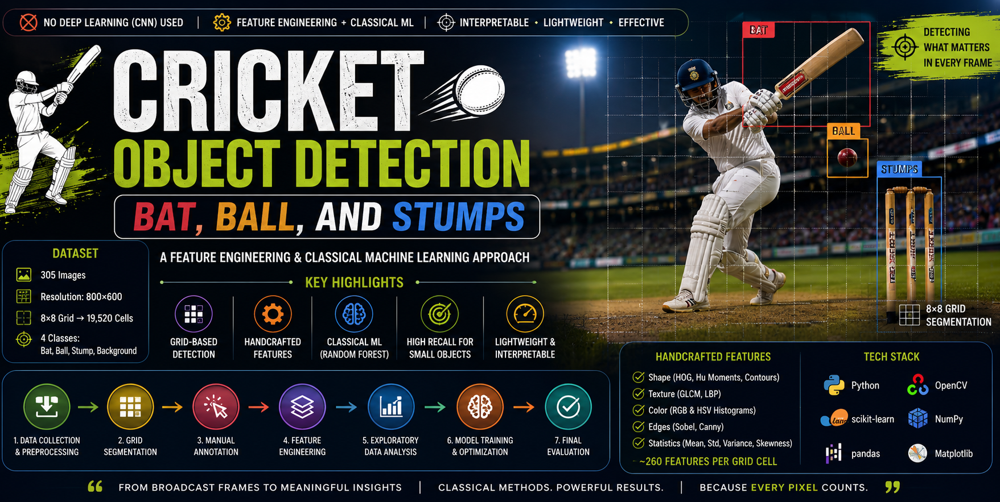

# 🏏 Cricket Object Detection using Classical Machine Learning

<p align="center">
  
</p>

<p align="center">


</p>

---



# 🏆 Overview

This project presents a **classical computer vision and machine learning approach** for detecting cricket objects—**Bat, Ball, and Stumps**—from broadcast cricket images **without using deep learning (CNNs)**.

Instead of convolutional neural networks, the project relies on **feature engineering**, handcrafted image descriptors, and supervised machine learning to solve the challenging problem of detecting very small objects in complex cricket scenes.

The work was completed as part of an academic project on **Object Detection using Feature Engineering & Classical Machine Learning.** :contentReference[oaicite:0]{index=0}

---

# 🎯 Project Goal

Develop an interpretable and lightweight object detection pipeline capable of detecting:

- 🏏 Cricket Bat
- 🔴 Cricket Ball
- 🪵 Cricket Stumps
- 🌿 Background

using only handcrafted image features and traditional machine learning algorithms.

---

# 🚀 Highlights

✔ No Deep Learning

✔ Feature Engineering Only

✔ Classical Machine Learning

✔ Grid-based Object Detection

✔ Random Forest Classifier

✔ Custom Annotation Tool

✔ OpenCV Pipeline

✔ 260+ Features per Grid Cell

✔ Small Object Detection

---

# 📂 Dataset

The dataset consists of manually collected cricket broadcast images.

### Sources

- Google Images
- ESPN Cricket
- Cricinfo
- IPL Videos
- YouTube Broadcast Frames

### Statistics

- Total Images : **305**
- Resolution : **800 × 600**
- Grid Size : **8 × 8**
- Total Grid Cells : **19,520**

Images were collected from internet downloads and extracted from cricket videos before preprocessing. :contentReference[oaicite:1]{index=1}

---

# 🏗 Project Workflow

```text
Collect Images
      │
      ▼
Resize Images
      │
      ▼
Grid Segmentation
      │
      ▼
Manual Annotation
      │
      ▼
Feature Engineering
      │
      ▼
Exploratory Data Analysis
      │
      ▼
Model Training
      │
      ▼
Performance Evaluation
```

This follows the project roadmap from data collection through final evaluation. :contentReference[oaicite:2]{index=2}

---

# 📁 Repository Structure

```
Cricket-Object-Detection/
│
├── data/
│
├── notebooks/
│   ├── Cricket_Object_Detection.ipynb
│   ├── ImageResize.ipynb
│   ├── LabellingTool.ipynb
│   └── EDA.ipynb
│
├── images/
│   ├── banner.png
│   ├── workflow.png
│   ├── feature_pipeline.png
│   ├── annotation_tool.png
│   ├── confusion_matrix.png
│   ├── feature_importance.png
│   └── prediction_examples.png
│
├── report/
│   └── Final_Report.pdf
│
├── README.md
├── requirements.txt
├── LICENSE
└── .gitignore
```

---

# 🖼 Data Preprocessing

The preprocessing pipeline includes:

- Image resizing
- Resolution validation
- Aspect ratio correction
- Bilinear interpolation
- Smart cropping
- Quality assurance

Final image size:

```
800 × 600
```

The resizing algorithm validates image quality, preserves a 4:3 aspect ratio where possible, and rejects images that are too small. :contentReference[oaicite:3]{index=3}

---

# 🏷 Manual Annotation Tool

A custom annotation tool was developed using **Python + OpenCV**.

Features:

- 8×8 Grid Overlay
- Mouse Click Annotation
- Color-coded Labels
- Automatic CSV Export
- Faster Dataset Labelling

Supported Labels

| Color | Object |
|---------|---------|
| 🟢 Green | Ball |
| 🔴 Red | Bat |
| 🔵 Blue | Stump |

The tool overlays an 8×8 grid, allows users to cycle labels with clicks, and saves annotations automatically. :contentReference[oaicite:4]{index=4}

---

# 🔬 Feature Engineering

Instead of CNN features, handcrafted descriptors were extracted.

## Shape Features

- HOG
- Hu Moments
- Contours
- Hough Transform

---

## Texture Features

- GLCM
- LBP

---

## Color Features

- RGB Histograms
- HSV Histograms

---

## Edge Features

- Sobel
- Canny

---

## Statistical Features

- Mean
- Standard Deviation
- Variance
- Skewness

Approximately **260 handcrafted features** were generated for each grid cell to capture shape, texture, color, edges, and statistical properties. :contentReference[oaicite:5]{index=5}

---

# 🤖 Machine Learning Model

After experimenting with clustering for automatic labeling, the project moved to supervised learning.

Classifier:

- Random Forest

Reasons:

- Handles high-dimensional data
- Robust against overfitting
- Interpretable
- Strong performance on handcrafted features

The project concluded that simple clustering was insufficient and adopted a supervised Random Forest pipeline after manual labeling. :contentReference[oaicite:6]{index=6}

---

# 📊 Exploratory Data Analysis

EDA includes:

- Label Distribution
- Feature Distribution
- Correlation Analysis
- Class Balance
- Missing Values
- Statistical Summary

---

# ⚙ Technologies Used

| Tool | Usage |
|------|------|
| Python | Programming |
| OpenCV | Image Processing |
| NumPy | Numerical Computing |
| Pandas | Data Analysis |
| Matplotlib | Visualization |
| Scikit-Learn | Machine Learning |
| Jupyter Notebook | Development |

---

# 📈 Challenges

The project addressed several practical computer vision challenges:

- Small object detection (especially the cricket ball)
- Object overlap and occlusion
- Complex backgrounds
- Motion blur
- Lighting variation
- Class imbalance
- High-dimensional handcrafted features

These challenges motivated the choice of feature engineering and careful preprocessing. :contentReference[oaicite:7]{index=7}

---

# 💡 Future Improvements

- Faster feature extraction
- XGBoost classifier
- Ensemble learning
- Object tracking
- YOLO comparison
- Vision Transformers comparison
- Hybrid Deep Learning + Classical ML

---

# ▶ Installation

```bash
git clone https://github.com/yourusername/Cricket-Object-Detection.git

cd Cricket-Object-Detection

pip install -r requirements.txt
```

---

# ▶ Run

```bash
jupyter notebook
```

Open

```
Cricket_Object_Detection.ipynb
```

---

# 📚 Report

The complete project report explaining the methodology, preprocessing, feature engineering, experiments, and evaluation is available in the `report/` directory.

---

# 👨‍💻 Author

**Manjusha Deore**

Machine Learning | Artificial Intelligence | Computer Vision

LinkedIn:
https://linkedin.com/in/your-profile

---

# ⭐ If you like this project

Please consider giving it a **Star ⭐** on GitHub.

It helps others discover the project!